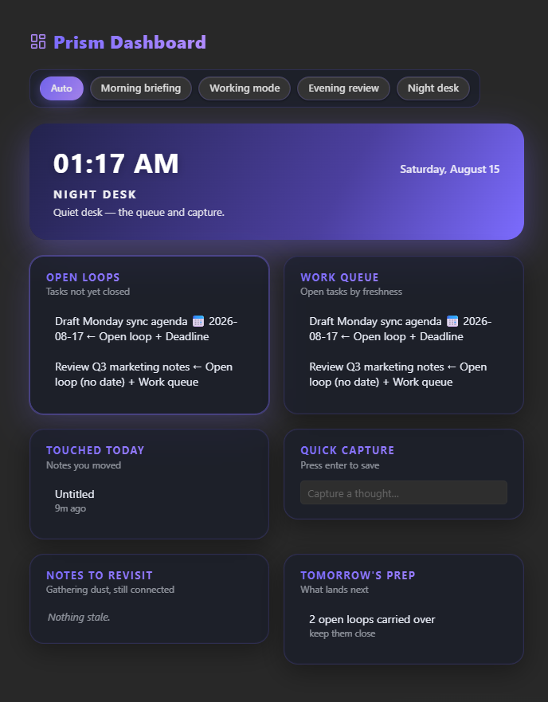
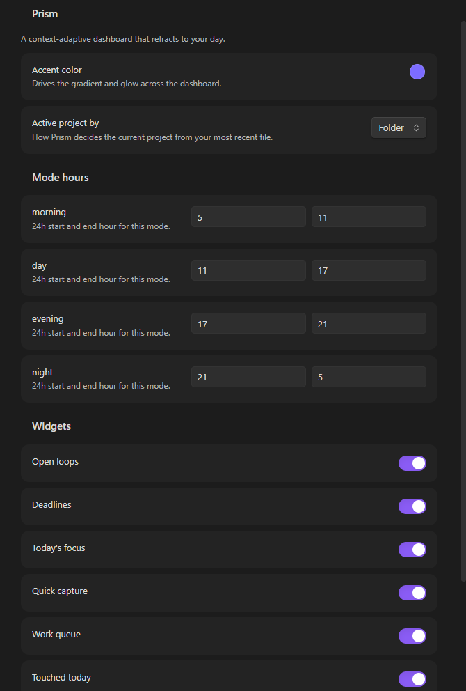
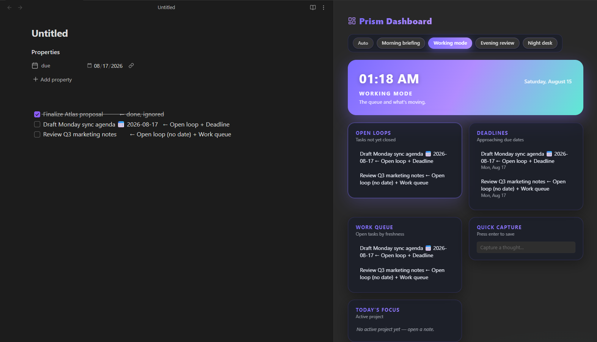
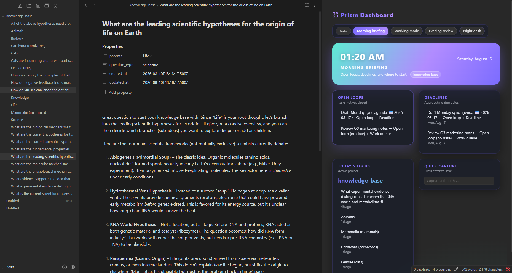

# Prism Dashboard

A context-adaptive dashboard for [Obsidian](https://obsidian.md) that reconfigures itself by time of day, active project, and live priority.

The dashboard reads your vault and reshapes itself across four modes — **Morning briefing**, **Working mode**, **Evening review**, and **Night desk** — surfacing what matters most right now instead of a static panel.


## Features

- **Adaptive by time of day** — modes shift automatically through morning, day, evening, and night, with a toolbar to override anytime.
- **Adaptive by project** — "Today's focus" derives the active project from your most recently opened note: its folder, or its frontmatter `project:` value (falling back to its first tag) when the tag setting is on.
- **Live priority ranking** — widgets re-rank by urgency (overdue tasks jump to the top), so the most important thing is always at the top of the grid.
- **Complete tasks in place** — task rows carry a completion ring: click it and Prism checks the task off in the note itself.
- **Quick capture** — type a thought, press Enter, and it's appended to `Capture.md` at your vault root.
- **Manual refresh** — a toolbar button forces a fresh read of the vault, next to a "last updated" timestamp.
- **Aurora styling** — glass cards, gradient hero, and per-mode color themes, matching light and dark Obsidian themes.

## Screenshots

| Morning | Day |
| --- | --- |
|  |  |

| Evening | Night |
| --- | --- |
|  |  |

## Widgets

| Widget | Shows | Modes |
| --- | --- | --- |
| Open loops | Open tasks, overdue ones first | morning · day · night |
| Deadlines | Tasks due within ~3 days | morning · day · evening |
| Work queue | Open tasks by note freshness | day · night |
| Today's focus | Active project + recent notes in it | morning · day |
| Quick capture | Inline capture box | all |
| Touched today | Notes edited today | evening · night |
| Notes to revisit | Notes untouched 7+ days, still linked | evening · night |
| Tomorrow's prep | What lands tomorrow | evening · night |

> Task rows with a ring (Open loops, Work queue, and task deadlines) can be
> completed in place — click the ring to check the task off in its note.

## How the data works

The dashboard reads ordinary Markdown — no separate setup needed.

**Tasks** feed Open loops, Work queue, and Deadlines. Each open task row shows a
completion ring — click it to mark the task done in its note:

```markdown
- [ ] Call the dentist                       <!-- open task -->
- [x] Book venue for demo                    <!-- done, ignored -->
- [ ] Ship signup flow fix 📅 2026-08-17    <!-- open task with due date -->
```

Due dates come from the inline `📅 YYYY-MM-DD` emoji, or from frontmatter on the note (inherited by its tasks):

```markdown
---
due: 2026-08-17
---

- [ ] Draft Monday sync agenda
```

**Today's focus** tracks your most recent file-open. In **Folder** mode the
active project is that file's parent folder; in **Tag** mode it's the file's
frontmatter `project:` value, or its first tag when no project is set — and
"Today's focus" then shows recent notes carrying the same project or tag.

**Notes to revisit** is automatic: notes untouched for 7+ days that still have at least one outgoing `[[link]]`.

**Quick capture** writes each capture as a bullet under `Capture.md`.

## Installation

1. Download the latest release from the [releases page](https://github.com/Stef4678/prism-dashboard/releases).
2. Unzip `main.js`, `manifest.json`, and `styles.css` into `YourVault/.obsidian/plugins/prism-dashboard/`.
3. Reload Obsidian, then enable **Prism Dashboard** under *Settings → Community plugins*.
4. Open it via the ribbon icon (dashboard) or the command palette: **Open dashboard**.

## Development

```bash
npm install        # install dependencies
npm run dev        # watch mode — rebuilds main.js on change
npm run build      # type-check + production build
```

The plugin is built with [esbuild](https://esbuild.github.io/) from TypeScript sources in `src/`.

## License

MIT © 2026 Kerekes Stefan
